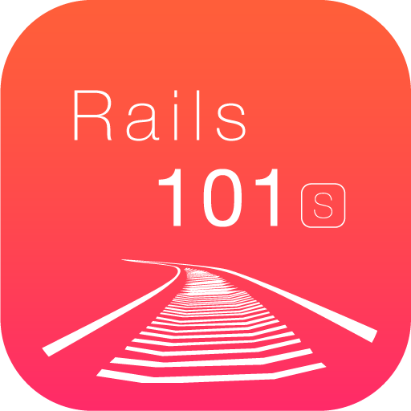
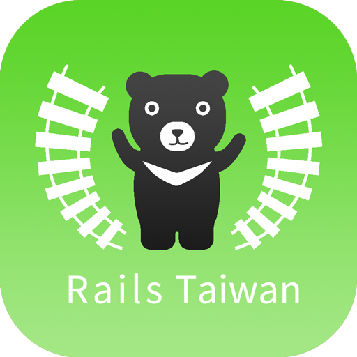

原作： xdite  ([原著](http://rails-101.logdown.com/))

改編： sdlong

[Gitbook 版](https://www.gitbook.io/book/sdlong/rails101s) 可下載成 PDF EPUB MOBI 等格式

[blog 位置](http://rails101s.logdown.com/)

# 本書內容為 Rails 101 without Bootstrapper

不用 Bootstrapper, 一切從 0 開始建置出 Rails 101 裡的專案
讓學 Rails 的新手可以減少遇到地雷的機會

並且從中理解到 Bootstrapper 裡的預設設定
(例如裝了哪些 gem ) 是有什麼意義的

重新排版與改編教程，延伸閱讀的註解
幫助各位用循序漸進，易讀的方式理解
Rails 101 裡面的 Code 的真正價值！

感謝原作者 xdite 授權本人重製、散布、傳輸以及修改著作（包括商業性利用）

---

test

## Rails Outreach 是個志於讓大家快速學習 Rails 的推廣活動

以在國外非常熱門流行的 [RailsBridge](http://zh-tw.railsbridge.org/docs/) 為教材
帶領完全沒接觸過網站開發 / Rails 相關資訊的新人，有個快速進入狀況，體驗 Rails 威力的學習方式

RailsBridge 中文版是由 [鴨七](http://blog.yorkxin.org/) 翻譯並 [Open Sources](https://github.com/rails-taiwan/railsbridge-docs)
我們需要您的一臂之力，繼續翻譯其他尚未翻譯的章節。

Rails Outreach 從 2014 年 05 月 台北場開始，短短二個月內陸陸續續在新竹、台中、台南、高雄等地開辦
除了您的參與學習，也鼓勵您成為下一場活動的種子教練，帶領更多人進入 Rails 的世界

[Rails Outreach 活動時間表](http://learn-rails.today/workshops)

---

# Rails Taiwan

Rails Taiwan是源於2011年6月開始，
每週二固定在臺北舉辦的Rails Taipei Meetup 社群，
專注分享與交流網站開發的技術與心得。

| Rails Taiwan 社群網站  | 網址 |
| :-----------------: | :----------------------------------- |
| Rails Taiwan 討論版 | http://forum.rails-taiwan.org/       |
| Learn Rails Today   | http://learn-rails.today/           |
| Meetup Rails Taiwan | http://www.meetup.com/rails-taiwan/ |

---

本 blog 內容採用 [CC BY-NC 3.0 TW](http://creativecommons.org/licenses/by-nc/3.0/tw/) 授權分享
可用於任何非商業性的分享、改編(如免費課程、推廣交流活動)，僅需附註原作者 xdite 與本作者 sdlong 的姓名
如需商業性使用(例如『收費』課程教材)，請事先聯繫本人( sdlong.jeng@gmail.com )取得授權，謝謝

有任何問題，包括文字 / 排版 / 程式 / 解釋錯誤，請聯絡本人修正，感謝！
